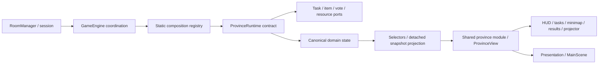

# Host + Projector dashboard hiện hành — 04/10/2026

`main.ts` dùng một `ui/dashboard/ProjectorDashboard` cho cả route host/projector; hai view cũ đã xóa. Projector là cùng layout ở chế độ đọc. Player branch, InputController, SocketClient, renderer và gameplay engine không thay trong task dashboard. CSS riêng được scope dưới `.projector-dashboard`.

- Shared `projectorDashboard.ts`: DTO DashboardRoom + selector snapshot→summary qua ProvinceView, không mutation/host token/player positions.
- Server `RoomManager.getDashboardOverview`: bảy default rooms, thay một dòng nếu xem custom room cùng tỉnh; GET `/api/dashboard?room=...` đọc summary, không tạo phòng.
- Client `dashboard/viewModel.ts`: merge snapshot socket của phòng đang xem lên overview, sort điểm và xử lý đồng hạng; aggregate counters/events. Bốn panel scoreboard/feed/featured/controls tách khỏi coordinator/layout. Giữ node/DOM thay vì rebuild mỗi snapshot.
- Phòng đang xem theo Socket.IO10Hz; overview7 tỉnh poll1s, lỗi có trạng thái chưa cập nhật. Không có tournament state ở UI hoặc server.
- GET `/api/qr` sinh QR tới sảnh chọn7 tỉnh. GET `/api/qr/:roomCode` giữ link trực tiếp phòng cho lobby/đồng đội.
- Host controls chỉ gửi command cũ của phòng hiện tại, giữ pending đến ACK, không giả phase/score/pause. Field gia hạn gửi ADD_60S theo số phút, default duration không đổi.

Bằng chứng current/build/giới hạn ở PROJECT_STATUS/TESTING; các mô tả view cũ phía dưới là lịch sử khi khác source hiện hành.

---

# Kiến trúc hiện hành — Province modules (04/10/2026)

Bảy tỉnh đã hoàn thiện đầy đủ 21 nhiệm vụ (100đ/tỉnh); chi tiết kiểm thử ở [PROJECT_STATUS](PROJECT_STATUS.md). Core điều phối, capability thực hiện cơ chế chung, province module sở hữu luật, state và dữ liệu trình bày đặc thù. Một room có một runtime gameplay độc lập, state không chia sẻ giữa các phòng.

```text
shared/src/gameplay/
  core/                      contracts, commands, catalogue/guide, timed objective composition
  presets/public-service/    preset luật dịch vụ công (dùng cho Hà Nội)
  provinces/
    hanoi/                   definition, presentation native
    ha-tinh/                 definition, commands, state, interactions, guide, view (rescue)
    ninh-binh/               definition, commands, state, interactions, guide, view (di sản & bảo vệ rừng)
    quang-ninh/              definition, commands, state, interactions, guide, view (công nghiệp & vịnh)
    hai-phong/               definition, commands, state, interactions, guide, view (cảng biển & foodtour)
    thanh-hoa/               definition, commands, state, interactions, guide, view (nem chua & an ninh)
    nghe-an/                 definition, commands, state, interactions, guide, view (cháo lươn & trật tự)
  registry.ts                static registry cho cả 7 module, definitions & getProvincePoiCoordinates

server/src/gameplay/
  core/                      ports, task, item, resource, vote, timed objective capability
  presets/public-service/    PublicServiceRuntime cho preset dịch vụ công
  provinces/
    ha-tinh/                 HatinhRuntime
    ninh-binh/               NinhBinhRuntime
    quang-ninh/              QuangNinhRuntime
    hai-phong/               HaiPhongRuntime
    thanh-hoa/               ThanhHoaRuntime
    nghe-an/                 NgheAnRuntime
  registry.ts                createProvinceRuntime factory đủ 7 MapIds

client/src/gameplay/
  core/regionalRenderer.ts   renderer nhận metadata/ProvinceView và visual state
  provinces/hanoi/           native presentation giữ crops/layers/depth
  registry.ts                chọn presentation; một MainScene bên ngoài thư mục này
```

Mỗi tỉnh quản lý POI đặc thù qua `state.ts` của tỉnh và đăng ký tra cứu linh hoạt qua `getProvincePoiCoordinates(mapId, poiId)`. Không làm vỡ `map.points` cơ bản của thế giới. Toàn bộ 7 tỉnh dùng chung swept movement/sliding, chân 14px, network prediction/reconcile và server authoritative validation.



## Trách nhiệm và authority

- RoomManager/server/SocketClient giữ room/session/socket/host/rejoin; GameEngine giữ player, lifecycle, receipts và transport. MOVE dùng shared segment validation; movement/collision/navigation/input/prediction không copy vào runtime tỉnh.
- PublicServiceRuntime nhận GameplayPorts, chỉ chứa luật medicalService/bridgeResponse/citizenRights. Task/vote/resource/item capability sở hữu cơ chế chung, runtime kiểm dependency/điều kiện/range và áp kết quả nghiệp vụ. Province không import GameEngine hoặc sửa toàn bộ engine qua context.
- HatinhRuntime sở hữu va/dg/dl và compose public-service capability cho practice/clinical facts/side paths vốn tồn tại. Không có handleHatinhAction trong GameEngine, không mutable sync rescue progression về m1/m2/m3. Tổng score và rescue summary derive; normalize chỉ clamp leaf scores và clear compatibility rewards theo behavior cũ.
- Shared ProvinceDefinition gồm quest composition/objectives, MapId, NPC/POI bindings và visual metadata. Guide/checklist/actions/markers/results/visual flags nằm ở preset/module. UI chung không quyết định nhiệm vụ tỉnh. getProvinceWorldState là selector nhẹ cho movement, tránh tạo recap/view mỗi frame.
- Registry là composition root có thể import concrete modules; GameEngine nhận ProvinceRuntime abstraction. Không dynamic discovery/event bus/DSL/container. Core không có branch theo MapId để hiểu luật cứu hộ hay dịch vụ công.

## State và compatibility

Public-service canonical state: medicalService, bridgeResponse, citizenRights, citizens và completion facts của standard objectives. Semantic quest IDs: medical-service, bridge-response, citizen-rights; rescue IDs ở definition Hà Tĩnh. Cơ chế resource ledger/item/vote/task có một owner infrastructure; domain state chỉ ghi sự kiện/điểm thuộc luật của mình.

m1/m2/m3/hatinhState trong GameSnapshot và read getters chỉ là detached compatibility projections. Không giữ totalScore mutable riêng, không cho getter trở thành writer. Test fixture capture concrete runtime qua injected factory để dựng trạng thái, không sửa legacy getters rồi mong ảnh hưởng room.

Wire IDs M1/M2/M3, DTO type aliases và facade catalogue/guide còn vì client/shared/QA đang tiêu thụ protocol này. Deletion gate: tất cả consumers/protocol cùng migrate và parity/conformance đạt; không xóa chỉ để đổi tên wire trong task behavior-preserving. Facade hanoiMap/hanoiScene/regionalScene và fallback registry migration đã xóa vì không còn consumer. HOST_COMMAND/type host lịch sử không được core dispatch thành host action; event thực là host_command như trước.

## Commands / dependency boundary

ClientIntent/GameplayCommand là union discriminated, StartTaskType có helper intents; ProvinceCommand và HatinhQuestCommand hỗ trợ caller có province/quest tĩnh. Compile checks bắt action không có, thiếu payload, sai coordinate type, plan không thuộc quest, rescue command không thuộc province. Province thực tại network luôn lấy từ room, không tin provinceId client gửi.

client_intent bắt đầu unknown; envelope/field shape được đọc an toàn và handler kiểm player/phase/range/dependency/resource/ownership như trước. Receipt fingerprint vẫn dựa trên raw type/payload, playerId + actionId, bounded2000/phòng, clear reset; không decode/rewrite trước fingerprint. Valid commands/ACK giữ behavior; missing/malformed envelope/task payload được reject thay vì crash. Đây không phải full security schema audit; các enum/auth legacy chưa harden toàn bộ được ghi trong PROJECT_STATUS.

## Thêm tính năng và phối hợp

Một objective tiêu chuẩn dùng timer hiện có: thêm objective definition ở module tỉnh (id/questId/pointId/JobType/duration/score/available), compose publicServiceModule/runtime, kiểm test. Capability tự đưa vào catalogue/guide/view/markers, sở hữu completion facts và derive score. Locality fixture Nghệ An chứng minh bằng module + test, không sửa core/UI/registry và không tham gia production bundle.

Feature cơ chế riêng: runtime/policy/view của tỉnh qua contract/ports; chỉ bổ sung capability chung khi cần cơ chế mới thực sự dùng lại. Presentation riêng: adapter/metadata của tỉnh; một MainScene giữ camera/input/network. Thêm tỉnh mới còn cần đăng ký MapId/map/module/runtime/presentation ở composition roots; không thêm branch nghiệp vụ vào core.

Hà Nội/Nghệ An/Hà Tĩnh có thể phát triển ở worktree riêng với thay đổi local. Shared preset/capability/contracts, wire/schema, registry và nguồn geometry/generator là phần cần phối hợp. Không coi refactor là đảm bảo merge không conflict đối với thay đổi cùng shared behavior.

Geometry/generator/asset paths và runtime ESM/CJS pipeline giữ nguyên; xem [MAPS](MAPS.md), [TESTING](TESTING.md). Asset relocation là task khác, không thuộc đợt này. Các luật có trước chưa hoàn chỉnh và giới hạn QA ở PROJECT_STATUS.

---

# Lịch sử kiến trúc trước / trong migration

Những entry points/handler/facade được mô tả phía dưới có thể đã bị xóa. Dùng phần hiện hành phía trên và repository để sửa code.

# Kiến trúc province modules — 7/7 đã migrate 04/10/2026

- Shared `gameplay/core`: contracts, typed commands, generic catalogue/lifecycle guide; `gameplay/presets/public-service`: composition, interactions/guide/view; `gameplay/provinces/<id>/definition.ts`: bảy cấu hình local; Hà Tĩnh có policy riêng. Static registry chọn module, không plugin discovery.
- Server `gameplay/core`: task/item/resource/voting capabilities qua ports; `presets/public-service`: semantic state medicalService/bridgeResponse/citizenRights và rules một implementation. Registry đã migrate đủ 7/7, không còn optional fallback. HatinhRuntime sở hữu rescue state + capability public-service còn cần cho practice/legacy clinic fields; core không chứa domain handlers.
- Client `gameplay/registry.ts` chọn presentation; một MainScene/input/network loop. Core regionalRenderer nhận metadata/ProvinceView, Hà Nội giữ native adapter. HUD/TaskPanel/voting/minimap/results/projector không đọc m1/m2/hatinh booleans; recap text giữ nguyên hành vi trước.
- Wire m1/m2/m3 và HATINH_ACTION giữ compatibility, deletion gate là tất cả client/QA consumers cùng phiên bản mới. Source internal preset đã dùng semantic IDs; không đổi protocol khi extraction.
- Projection m1/m2/m3/hatinhState được copy để không trở thành writer. Fixtures giữ reference runtime qua injected factory, chỉ test sửa canonical state. Hatinh score summary derive, không sync scores/status vào state khác. Legacy clinic capability giữ các side paths trước đó và world flags, không là fallback của migration.
- Runtime migration hiện tại/bằng chứng trong PROJECT_STATUS. Các mục dưới mô tả implementation trước refactor; không dùng chúng để suy ra boundary mới.

---

# Kiến trúc đang hoạt động

Đối chiếu source ngày 04/10/2026, gồm movement/collision và input/interaction hiện tại. Trạng thái lần chạy/working tree: [PROJECT_STATUS](PROJECT_STATUS.md); nhiệm vụ bàn giao: [TASK_CURRENT](../TASK_CURRENT.md). Đặc tả gameplay: [MVP_SPEC](MVP_SPEC.md); khi tài liệu cũ khác implementation, repository quyết định hành vi thật.

## Thành phần và entry point

| Thư mục | Vai trò / entry point |
| --- | --- |
| `client/` | Vite + TypeScript + Phaser 3, DOM UI/Tailwind build cục bộ. `index.html` → `src/main.ts::initApp` phân route; `game/phaserGame.ts::createGame` mở `scenes/MainScene.ts`. |
| `server/` | Express + HTTP + Socket.IO. `src/server.ts` mở API/socket, phục vụ `client/dist` hoặc `CLIENT_DIST_PATH`, tick 100 ms. `roomManager.ts::RoomManager` sở hữu phòng/session; `gameEngine.ts::GameEngine` sở hữu gameplay từng phòng. |
| `shared/` | Types, hằng số, học thuật, registry/geometry, movement, route, mission guide và catalogue/resolver tương tác. `src/index.ts` export; server/QA import `shared/dist`, Vite alias đến `shared/src`. |
| `scripts/` | Chuẩn bị asset/dữ liệu và QA qua Socket.IO; không cần chạy script ảnh cho mỗi lần build. |
| `client/public/assets/` | Asset phục vụ cùng origin; scene v3, sprite v2, sáu vùng và ghi công. Các SVG/LPC/ninja cũ vẫn giữ. |
| `docs/` | Đặc tả, nguồn mỹ thuật, ảnh/concept, báo cáo kiểm tra và trạng thái bàn giao. |

Root npm workspaces: `shared`, `server`, `client`. Build tuần tự shared → server → client. Không sửa `dist/`: đây là đầu ra được gitignore. Xem cấu hình và lệnh ở [README](../README.md).

## Luồng chơi

1. `lobbyView.ts` hiển thị `GAME_MAPS`, chọn vùng và tên. Khám phá dùng phòng mặc định; tạo solo/đội gọi `POST /api/rooms/create` với `mapId`. Host token lưu sessionStorage của trình duyệt tạo phòng. Solo còn đặt cờ `start_solo_room` rồi gửi START sau joined.
2. `/play/:roomCode`: `main.ts` đọc metadata phòng **trước** preload Phaser, chọn map bất biến của phòng, dựng UI và gọi `SocketClient.joinRoom`. Mã phòng chưa có có thể được server socket tạo mặc định Hà Nội; không coi lựa chọn sảnh là mapId của một phòng tùy ý.
3. `InputController` gom bàn phím/cần ảo; `MainScene` dự đoán với solver/geometry chung, gửi MOVE có path khoảng mỗi 66 ms. Reconcile theo snapshot/ACK, dùng epoch để bỏ phản hồi MOVE cũ sau rejoin. HUD/mobile/drawer dùng cùng đường thực thi action, không tự sửa gameplay.
4. `server.ts` tìm engine theo socket room, gọi `GameEngine.handleIntent` cho mọi `client_intent` và trả ACK. Thành công phát snapshot ngay; tick định kỳ phát snapshot 10 Hz. `host_command` vẫn là event riêng gọi `hostAction` với hostToken.
5. `MainScene` cập nhật người chơi, kiện, công trình và bridge; `hudView`, `taskPanel`, `actionPanel`, các modal cập nhật ngân sách/tiến độ/minimap theo cùng snapshot. `getMissionGuide` chọn đích; `findWalkingRoute` dựng đường đi thực.

Event scene-ready vẫn tên `hanoi-ready` vì lịch sử, nhưng được phát cho mọi map. `hanoiMap.ts` hiện là facade export preload/animation/renderer, không phải renderer procedural v2. `hanoiLayout.ts` giữ dữ liệu cây v2, không được renderer cảnh hiện tại import.

## State và lưu trữ

`RoomPhase`: LOBBY → BRIEFING → PRACTICE → RUNNING → RESULTS. M1/M2/M3 có LOCKED/ACTIVE/RESOLVED; publish kết thúc một nhiệm vụ và kích hoạt nhiệm vụ sau. `GameSnapshot.mapId` theo `engine.map.id`. GameEngine có nguồn lực/kiện/citizens/job/vote/audit/điểm và dedupe actionId; mỗi phòng có engine riêng.

Rooms, hostTokens, playerSessions, socket metadata đều ở RAM. Không database, không save/restore phòng khi process khởi động lại, không bộ điều phối nhiều server. Client lưu `player_name` và `token_<ROOM>` ở localStorage, `host_token_<ROOM>`/cờ solo ở sessionStorage. Không chép giá trị token vào report hoặc tài liệu.

Reconnect với token đúng phòng dùng lại playerId. Grace 10 giây theo `Date.now()`; sau grace tick giải phóng job/manpower và đặt kiện xuống đất. Không có người chơi thật online trong RUNNING sẽ auto-pause; spectator không được tính. Host RESUME khi có người trở lại. Khác socket nhưng cùng storage/token có thể cùng playerId; QA hai người nên dùng profile/browser/device riêng.

## Giao thức thực tế

| HTTP | Dữ liệu / tác dụng |
| --- | --- |
| GET `/api/maps` | Metadata bảy vùng và URL scene/minimap/icon. |
| GET `/api/rooms` | Phòng, mapId, phase, playerCount và score của **từng phòng**; chưa phải scoreboard liên đội. |
| GET `/api/rooms/:roomCode` | `{roomCode,mapId}`; chưa có phòng trả 404. |
| POST `/api/rooms/create` | `{customCode?,mapId?}` → mã phòng + host token + mapId. Mặc định Hà Nội, 400 nếu ID/code sai, 409 nếu code có sẵn. Không công bố token trả về. |
| GET `/api/network-info` | IP LAN/cổng/publicBaseUrl. |
| GET `/api/qr/:roomCode` | QR data URL + joinUrl dựa trên PUBLIC_HOST hoặc LAN. |

| Socket event | Vai trò |
| --- | --- |
| `join_room` → `joined_room` | roomCode, name, optional player/host token, isHost/isSpectator → session/snapshot; host response chỉ cho lượt host. |
| `client_intent` → ACK | actionId/type/payload. MOVE, SET_ROLE, START/CANCEL_JOB, PICK/DROP/DELIVER/RETURN_CRATE, PROPOSE_PLAN, CAST_VOTE, PUBLISH_NOTICE, CONFIRM_M3_PLAN. |
| `host_command` → ACK | `{command,hostToken}`; START/SKIP_BRIEFING/SKIP_PRACTICE/PAUSE/RESUME/ADD_60S/END/RESET. Đây là event thực; `HostCommandPayload.action` trong shared là type lịch sử, không phải tên field đang dùng ở wire. |
| `room_snapshot` | Toàn trạng thái phòng sau join/hành động và mỗi tick. |
| `disconnect` | Đánh offline để xử lý grace và auto-pause. |

Ba thao tác `START_JOB` có payload type `SURVEY_BRIDGE`, `RECEIVE_FEEDBACK_C`, `CROSS_CHECK_CLINIC` đi qua `handleIntent` → `handleStartJob` → helper engine, giữ actionId của request. Chúng chưa nằm trong union `JobType`, không phải job countdown; catalogue kiểm eligibility trước helper. Không thêm nhánh socket bypass đường này.

Server kiểm điểm đến và từng đoạn MOVE từ vị trí authoritative qua path, giới hạn số điểm theo MOVEMENT_CONFIG; chưa kiểm tốc độ theo thời gian. CollisionState gồm bridgeBlocked/fixedDeployed/mobileBDeployed/mobileCDeployed dùng chung client/server/navigation. Chân14px, swept/sliding, corner assist tắt; người chơi đi xuyên nhau. Server recovery khi cầu hỏng hoặc công trình mới gây overlap.

Join host không đưa token vẫn có nhánh cấp host trong mô hình lớp học hiện tại. HostView/VotingModal đã escape tên hiển thị; chưa có chứng nhận audit toàn bộ HTML/payload/auth hay chống gian lận công khai.

## Input, tương tác và receipt

- `inputController.ts`: WASD/Arrows + Shift qua state `read()`; E/G/M/Esc qua action cạnh. Mobile joystick/E/G và HUD Map/Menu gọi cùng controller. Reset khi blur/hidden/đổi lock/disconnect/rejoin; không replay input cũ sau đóng Menu. F2 debug vẫn do Phaser nhận.
- `interactions.ts`: `getInteractionActions` cung cấp catalogue cho HUD/drawer và eligibility START_JOB server. `resolveInteraction` lọc range72 ở cả predicted và authoritative; ưu tiên delivery100, ground pickup/return90, job80, plan70, stock60; giữ candidate cùng priority trong ngưỡng12px khi vẫn hợp lệ. G: cancel → drop → ping. Không tự chọn phương án HQ.
- `MainScene.executeAction`: một pending, drain MOVE tối đa2s rồi kiểm context/range lại, gửi intent, feedback theo ACK; cooldown300ms sau hoàn tất. Không optimistic cargo/quest/score. Drawer không khóa movement; Menu/modal bắt buộc khóa input, Menu không pause phòng. M giữ overview khi đi; định vị waypoint chuyển follow.
- `SocketClient`: CONNECTED chỉ sau joined/rejoined thành công khi đã chọn phòng; từ chối intent offline/chưa rejoin, không buffer replay; ACK timeout8s. Timeout không chứng minh server chưa áp dụng action, phải đọc snapshot.
- `GameEngine.handleIntent`: receipt key playerId+actionId, fingerprint type/payload, retry giống nhau trả ACK đã lưu; payload khác cùng ID bị reject. Lưu kết quả sau dispatch, gồm success/reject; guard đầu hàm (offline/pause) trả sớm không được cache. Tối đa2000 receipt/phòng, clear khi reset, chỉ ở RAM.
- Job đang chạy giữ type+target để ngăn claimant thứ hai; explicit crateId không fallback sang kiện khác/kho khi đã bị lấy. Catalogue là điều kiện chọn action, handlers vẫn kiểm khoảng cách và mutation authoritative.

## Muốn sửa X → mở Y → kiểm Z

| X | File / symbol | Phụ thuộc và kiểm tra |
| --- | --- | --- |
| Giá/điểm/thời gian | `shared/src/constants.ts::{PLAN_COSTS,SCORES,JOB_DURATION}`; `GameEngine` | MVP_SPEC, recap, bốn tổ hợp, bảo toàn nguồn lực. |
| Trình tự nhiệm vụ/job | `gameEngine.ts::{handleStartJob,completeJob,handlePublishNotice,resolveM1/2/3}` | ActionPanel, missionGuide, fixtures và happy/negative path. |
| Vote/solo | `gameEngine.ts::{startVote,handleCastVote,resolveVote}` | votingModal, pause/disconnect, tài nguyên và phiếu hợp lệ. |
| Session/host/phòng | `server.ts` socket/API handlers; `RoomManager`, `SocketClient` | Nhiều client độc lập, token đúng/sai, restart và phòng khác nhau. |
| Map/route/POI | `worldMaps.ts`, `mapData.ts`, `navigation.ts`, script vùng | [MAPS](MAPS.md); cả bridge nguyên/hỏng và server/client khớp. |
| Mỹ thuật/depth/cầu | `hanoiScene.ts`, `regionalScene.ts::{preloadRegion,drawRegion}` | Asset preload, polygon layers, foot depth, ảnh chụp state thật. |
| Input/tương tác | `inputController.ts`, `interactions.ts::{getInteractionActions,resolveInteraction}`, `MainScene::{executeAction,getInputLock}` | Pending/ACK, context/range, reservation, typing/blur/rejoin, PC/mobile; inputInteraction.test và verify-input-* scripts. |
| Camera/movement | `MainScene::{resizeCamera,handleMovement,flushMovement}`, `movement.ts`, `collisionGeometry.ts` | Overview giữ khi đi, waypoint vào follow, segment validation, foot/deployment flags. |
| HUD/sảnh/mobile | `ui/hudView.ts`, `lobbyView.ts`, `practiceModal.ts`, `touchControls.ts`, CSS | Map selected, thao tác không bị overlay che, viewport thực. |
| Học thuật | `knowledgeMap.ts::{KNOWLEDGE_INTRO,KNOWLEDGE_RULES,KNOWLEDGE_SOURCES,generateRecap}` | KNOWLEDGE_MAP và nguồn giáo trình; không thay rule sản phẩm bằng câu chữ. |

Phân loại renderer/asset lịch sử và file sinh tại [ART_SOURCES](ART_SOURCES.md), [MAPS](MAPS.md); chứng cứ QA tại [TESTING](TESTING.md).
